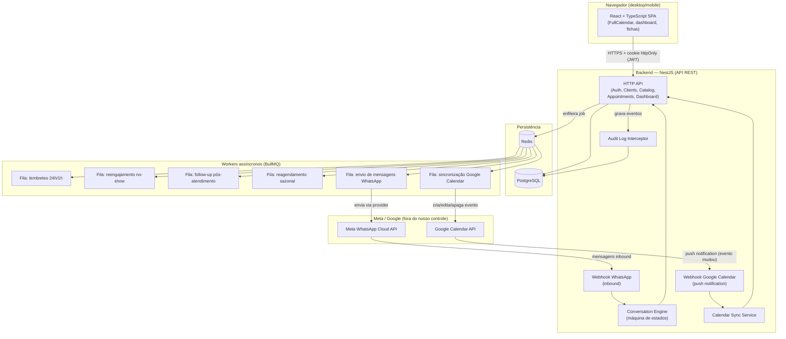

# Arquitetura do Sistema — CRM de Agenda para Consultoria de Imagem

## 1. Visão geral

Sistema web single-tenant (1 consultora principal + equipe de apoio, papéis
`admin` / `gestor` / `atendente`), pensado para operar com baixo custo de
infraestrutura no volume atual (~60 atendimentos/mês) mas com um modelo de
dados e módulos já preparados para crescer (mais profissionais, mais canais,
multi-tenant no futuro — ver `04-plano-implementacao.md`).

Princípios de design que guiaram todas as decisões abaixo:

1. **O WhatsApp e o Google Calendar são periféricos, não o núcleo.** O core
   (agenda, clientes, catálogo, regras de negócio) vive inteiramente no
   backend e funciona mesmo se as duas integrações caírem. Isso atende ao
   requisito não-funcional "falha no WhatsApp não pode derrubar o resto do
   sistema".
2. **Toda escrita de agenda passa por um único serviço** (`AppointmentsService`),
   não importa se a origem é a UI web, o WhatsApp ou um webhook do Google.
   Isso é o que evita duplicidade/conflito de horários entre CRM ↔ Google.
3. **Provider pattern nas integrações externas.** WhatsApp e Google Calendar
   são acessados por trás de uma interface (`WhatsappProvider`,
   `CalendarProvider`), com uma implementação real (Meta Cloud API / Google
   API) e uma implementação mock. Isso permite construir e testar o sistema
   inteiro antes mesmo de ter as contas Meta/Google aprovadas — que é a
   situação atual do projeto.
4. **Filas assíncronas para tudo que é "vai falhar às vezes"**: envio de
   WhatsApp, chamadas à API do Google, lembretes agendados. Nada disso roda
   de forma síncrona dentro do request HTTP que o usuário está esperando.

## 2. Diagrama de componentes

## 3. Backend — NestJS, módulos

| Módulo | Responsabilidade |
|---|---|
| `auth` | Login e-mail/senha (bcrypt + JWT em cookie httpOnly), login com Google (OAuth "Sign in"), guards de sessão. |
| `users` | Contas dos profissionais/atendentes, papéis (`ADMIN`, `MANAGER`, `ATTENDANT`), permissões. |
| `clients` | Ficha da cliente: dados pessoais, medidas, tipo de corpo, paleta de cores, estilo predominante, orçamento médio, marcas preferidas, restrições, consentimento LGPD, histórico, mídia (looks/mood boards). |
| `catalog` | Catálogo de serviços (tipos de consultoria) com duração e preço. |
| `appointments` | Núcleo da agenda: CRUD de agendamentos, bloqueios de horário (folga/almoço/feriado), detecção de conflito, transições de status (`SCHEDULED → CONFIRMED → COMPLETED / NO_SHOW / CANCELLED`). Única porta de entrada para qualquer escrita de agenda. |
| `calendar-sync` | OAuth2 com Google, criação/edição/exclusão de eventos espelhados, recepção de webhook de push notification do Google, lógica anti-loop (evita re-sincronizar um evento que a própria sync acabou de escrever). |
| `whatsapp` | Webhook de recebimento (Meta Cloud API), `WhatsappProvider` (interface) com implementações `MetaCloudApiProvider` e `MockWhatsappProvider`, motor de conversa (agendar/remarcar/cancelar/confirmar), download e associação de mídia recebida ao perfil da cliente. |
| `notifications` | Filas BullMQ e processors: lembrete 24h/1h, reengajamento pós no-show, follow-up de estilo pós-atendimento, sugestão de reagendamento sazonal. |
| `dashboard` | Agregações: agendamentos do dia, taxa de confirmação, taxa de no-show, ocupação por profissional, projeção de faturamento. |
| `audit-log` | Interceptor global que grava quem mudou o quê, quando, e o valor antes/depois, para qualquer entidade sensível (agendamentos, clientes, usuários). |
| `common` | Guards (JWT, Roles), pipes de validação, filtro de exceção que isola falhas de integração externa do restante da request. |

### Por que NestJS

Módulos com fronteiras explícitas, DI nativa (fácil trocar
`MockWhatsappProvider` por `MetaCloudApiProvider` via config, sem mudar
código de negócio), guards/interceptors de primeira classe para
autenticação/autorização/auditoria, e integração natural com BullMQ
(`@nestjs/bullmq`) e Prisma.

## 4. Frontend — React + TypeScript

SPA servida por Vite, consumindo a API REST via `fetch`/axios com cookies
httpOnly (sessão), sem tokens em `localStorage` (mitiga XSS roubando sessão).

- **Agenda**: `FullCalendar` (visões dia/semana/mês, drag-and-drop,
  recursos = profissionais quando houver mais de um).
- **Dashboard**: KPIs do dia + gráficos (ocupação, confirmação, no-show,
  projeção de faturamento).
- **Clientes**: lista + ficha completa (estilo, medidas, mídia, histórico,
  timeline de interações incluindo mensagens de WhatsApp).
- **Catálogo de serviços**, **Configurações/Integrações** (conectar Google,
  status do WhatsApp, automações), **Usuários** (admin).

Responsivo (mobile-first nos componentes de agenda e ficha de cliente, já
que a consultora vai olhar o CRM pelo celular boa parte do tempo).

## 5. Por que Postgres + Redis/BullMQ

- **PostgreSQL**: dados relacionais com integridade forte (um agendamento
  pertence a exatamente um profissional, um cliente, um serviço; conflitos
  de horário são uma constraint de negócio que se beneficia de transações
  ACID). `EXCLUDE` constraint com `tsrange` é usada para impedir
  sobreposição de horários no nível do banco, como última linha de defesa
  além da checagem em código.
- **Redis + BullMQ**: lembretes agendados (24h/1h antes) são jobs com
  `delay` calculado no momento da criação/edição do agendamento; se o
  agendamento for remarcado ou cancelado, o job é removido/reagendado.
  BullMQ dá retry automático com backoff para envios que falharem (ex.:
  Meta API fora do ar), sem travar a request HTTP original.

## 6. Autenticação e sessão

- Login e-mail/senha: `bcrypt` (custo 12) + Passport `local` strategy.
- Login com Google: Passport `google-oauth20`, cria/vincula usuário pelo
  e-mail verificado do Google.
- Sessão: JWT de curta duração (15 min) em cookie `httpOnly`, `Secure`,
  `SameSite=Lax`, + refresh token de vida mais longa (7 dias) também em
  cookie httpOnly, rotacionado a cada uso. Nenhum token acessível via JS.
- Autorização: `RolesGuard` lê `roles` do JWT e o papel exigido no handler
  (`@Roles('ADMIN')`), decisão em cada endpoint sensível.

Importante: o OAuth do Google usado para **login** é uma credencial distinta
da usada para **sincronizar a agenda** (escopos diferentes — login pede só
identidade/e-mail; sync de calendário pede
`https://www.googleapis.com/auth/calendar`). Cada profissional conecta sua
própria agenda Google independentemente de como fez login.

## 7. Isolamento de falhas (requisito não-funcional crítico)

- Todo acesso a Meta API / Google API acontece **dentro de um worker BullMQ**
  ou atrás de um `try/catch` que nunca propaga para a request HTTP do
  usuário quando a chamada é "melhor esforço" (ex.: salvar o agendamento no
  Postgres sempre funciona; espelhar no Google é um job separado que pode
  falhar e ser reprocessado sem afetar o que já foi salvo).
- `WhatsappModule` e `CalendarSyncModule` expõem um health-check próprio
  (`/health/whatsapp`, `/health/calendar`) consumido pelo dashboard, para a
  consultora ver "WhatsApp: conectado ✅ / Google: token expirado ⚠️" sem
  que isso jamais derrube login, agenda ou ficha de clientes.
- Circuit breaker simples (contagem de falhas consecutivas) desliga
  temporariamente tentativas de chamada externa e cai para modo
  degradado (fila acumula, backend segue saudável) em vez de martelar uma
  API fora do ar.

## 8. Multi-fuso-horário

Todo horário é armazenado em UTC (`timestamptz` no Postgres). O fuso de cada
profissional/unidade é um campo de configuração; toda exibição/formulário
converte para o fuso local no frontend (usando `Intl`/`date-fns-tz`). Os
eventos do Google Calendar já carregam fuso horário próprio — a sincronização
sempre normaliza para UTC antes de comparar/gravar.

## 9. LGPD

- Campo de consentimento explícito por canal (`whatsappConsent`,
  `marketingConsent`) na ficha do cliente, com timestamp e origem (ex.:
  "consentiu via mensagem de WhatsApp em 12/03/2026").
- Endpoint de exclusão/anonimização de dados do titular
  (`DELETE /clients/:id/personal-data`), que anonimiza PII mas preserva
  metadados agregados não identificáveis (para não quebrar relatórios
  históricos).
- Log de auditoria cobre também acessos/exportações de dados sensíveis, não
  só alterações de agenda.

## 10. Deploy

- **Dev**: `docker-compose` local (Postgres, Redis, backend, frontend).
- **Produção sugerida**: frontend na Vercel (build estático), backend +
  worker BullMQ no Railway/Render (processo web + processo worker
  separados, mesma imagem Docker), Postgres/Redis gerenciados pelo mesmo
  provedor. Webhooks (Meta, Google) exigem HTTPS público — Railway/Render
  fornecem isso por padrão.
