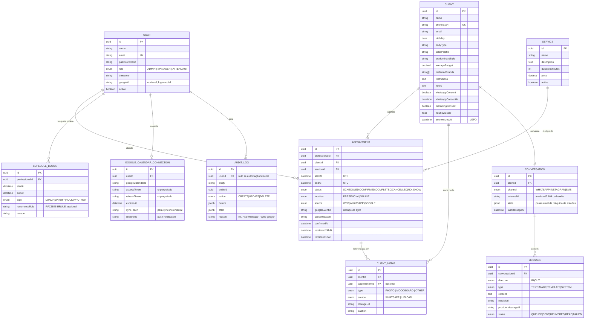

# Modelo de Dados

Este documento descreve as entidades do domínio e como elas se relacionam.
Ele espelha `backend/prisma/schema.prisma` — em caso de dúvida, o schema é a
fonte da verdade; este arquivo é o mapa de leitura.

## 1. Diagrama de entidades

## 2. Decisões de modelagem que importam

- **`Appointment.source`** guarda a origem da escrita (`WEB`, `WHATSAPP`,
  `GOOGLE`). É o que permite ao `CalendarSyncService` saber "esse evento eu
  mesmo criei ao sincronizar do Google, não preciso reenviar pro Google" —
  a peça central que evita o loop de duplicação bidirecional.
- **`Appointment.googleEventId`** é único e indexado; é a chave de
  deduplicação entre CRM e Google Calendar nos dois sentidos.
- **Constraint de não-sobreposição**: além da checagem em `AppointmentsService`,
  o banco tem uma `EXCLUDE USING gist` sobre
  `(professionalId, tsrange(startAt, endAt))` para `status NOT IN
  ('CANCELLED')`, garantindo no nível de dados que dois agendamentos ativos
  do mesmo profissional nunca se sobrepõem, mesmo sob concorrência.
- **`Client.noShowScore`** é um `float` recalculado por um job (não uma
  coluna computada), alimentado por: nº de no-shows / nº total de
  agendamentos, atraso médio de confirmação, cancelamentos em cima da hora.
  Ver `04-plano-implementacao.md` (Fase 2) para a fórmula completa.
- **`Conversation.state`** é `jsonb` livre porque a máquina de estados da
  conversa de WhatsApp (Fase 1: regras determinísticas; Fase 2: IA) muda de
  forma mais rápida que o schema relacional deveria mudar — o "formato" do
  estado é responsabilidade do `whatsapp` module, não do banco.
- **`ClientMedia.appointmentId`** é opcional: uma foto pode ter sido enviada
  fora de um atendimento específico (ex.: cliente manda referência de look
  fora de horário marcado) e ainda assim cair na ficha dela.
- **Tokens do Google (`accessToken`/`refreshToken`) são armazenados
  criptografados em repouso** (AES-256-GCM, chave fora do banco, em variável
  de ambiente/secret manager) — nunca em texto puro, mesmo dentro do próprio
  Postgres.
- **`AuditLog` é append-only** (sem update/delete permitidos pela aplicação),
  cobrindo todas as mutações de `Appointment`, `Client`, `User`.

## 3. O que fica para fases futuras (não está no schema do MVP)

- `AutomationRule` (trigger → condições → ações, no-code): tabela dedicada
  quando o construtor visual de automações for implementado (Fase 3).
- `RevenueForecast`/materialized views para relatórios preditivos mais
  sofisticados (Fase 3) — o MVP calcula projeção simples on-the-fly a partir
  de `Appointment` + `Service.price`.
- Suporte a múltiplos canais (`Conversation.channel` já prevê `INSTAGRAM` e
  `SMS`, mas só `WHATSAPP` tem provider implementado no MVP).
