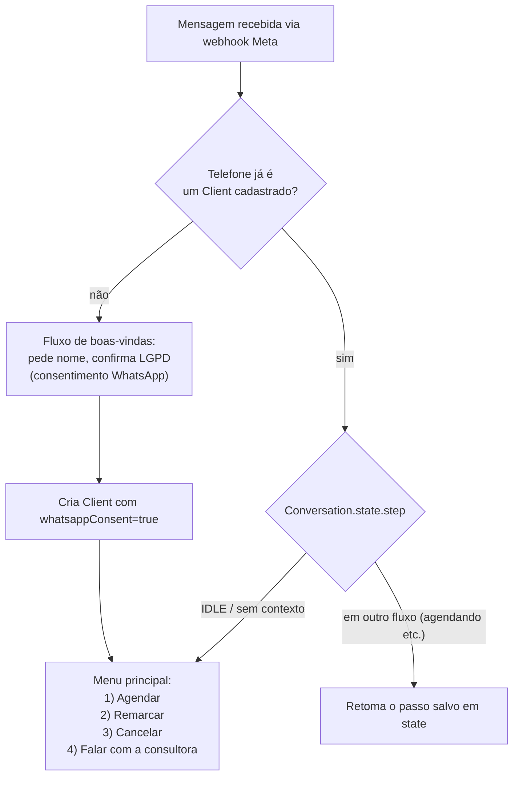
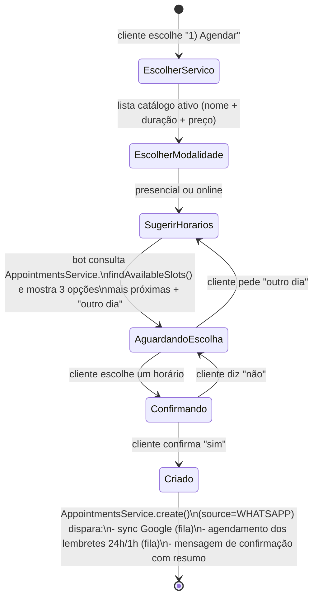
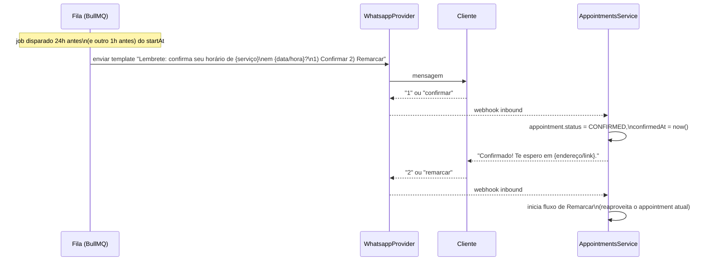
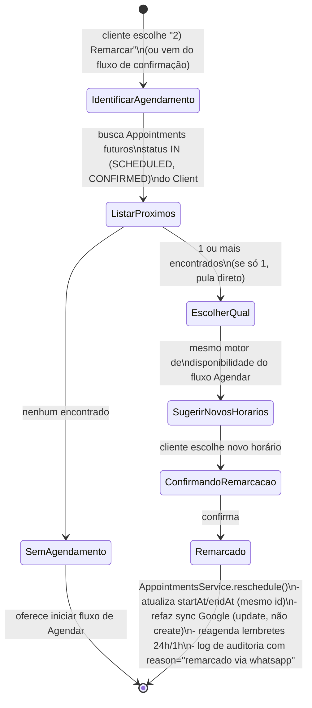
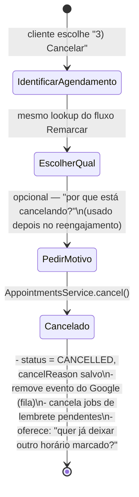

# Fluxos de Conversa no WhatsApp

O motor de conversa (`whatsapp/conversation-engine`) é uma máquina de
estados determinística no MVP (Fase 1). Cada `Conversation.state` guarda o
passo atual + dados coletados até ali. Na Fase 2, uma camada de NLU (via LLM)
é adicionada **na frente** dessa mesma máquina: em vez de exigir que o
cliente digite "1", "2", "3", o LLM extrai a intenção e os slots (serviço,
data/hora preferida, se é remarcação de qual agendamento) e alimenta os
mesmos estados — o motor de baixo nível não muda, só ganha um parser melhor
na entrada. Isso é o que torna o "assistente de IA no WhatsApp" seguro de
implementar depois: a lógica de negócio (checar conflito, confirmar,
cancelar) já está testada e estável antes de existir qualquer IA no meio.

Todas as respostas do bot citam handles curtos (`1`, `2`, "sim", "outro
horário") para o MVP funcionar 100% por regras, sem depender de LLM
desde o dia 1.

## 1. Roteamento inicial de qualquer mensagem recebida

- Se a mensagem contiver mídia (foto) e não houver comando explícito de
  agendamento em andamento, ela é salva direto em `ClientMedia` associada ao
  cliente (e ao agendamento mais recente, se houver um em andamento) e o bot
  responde confirmando o recebimento — sem precisar de nenhum passo extra.
- Qualquer mensagem fora do fluxo esperado (bot não entendeu) cai em
  `Falar com a consultora`, que marca a conversa como `precisa_humano=true`
  e notifica o profissional — nunca deixa o cliente "preso" num loop de bot.

## 2. Fluxo: Agendar

Regras de negócio aplicadas nesse fluxo (no `AppointmentsService`, não no
bot — o bot só chama o serviço):

- Horários sugeridos nunca colidem com `ScheduleBlock` (almoço, folga,
  feriado) nem com outro `Appointment` ativo do profissional.
- Se o cliente pedir um horário específico ("amanhã às 15h") e ele estiver
  ocupado, o bot já responde com as alternativas mais próximas em vez de só
  dizer "indisponível".
- Todo agendamento criado por esse fluxo nasce com `status=SCHEDULED` e
  `source=WHATSAPP`.

## 3. Fluxo: Confirmar (lembrete automático)

- Se não houver resposta ao lembrete de 1h, o agendamento segue
  `SCHEDULED` (não vira automaticamente `NO_SHOW` — isso só é decidido após
  o horário passar, ver fluxo de No-show em `04-plano-implementacao.md` /
  Fase 2, "score de no-show").
- Falha de envio do lembrete (Meta API fora do ar) não cancela nem altera o
  agendamento: o job vai para retry com backoff exponencial (BullMQ) e, após
  esgotar as tentativas, gera uma notificação interna para a consultora
  confirmar manualmente.

## 4. Fluxo: Remarcar

`reschedule()` **não** cria um novo `Appointment` — atualiza o existente, o
que preserva o `googleEventId` (edita o evento no Google em vez de duplicar)
e o histórico de auditoria.

## 5. Fluxo: Cancelar

- Cancelamento feito com menos de X horas de antecedência (configurável,
  default 12h) é sinalizado (`lateCancel=true` no log de auditoria) e conta
  para o score de no-show do cliente (Fase 2).

## 6. Robustez do motor de conversa

- **Timeout de contexto**: se o cliente some no meio de um fluxo (ex.: parou
  em "escolha um horário") por mais de 30 minutos, o próximo contato dele
  reinicia no menu principal em vez de tentar retomar um contexto morto.
- **Concorrência**: se a consultora alterar o mesmo agendamento pela web
  exatamente enquanto o cliente está remarcando pelo WhatsApp, o
  `AppointmentsService` é a única porta de escrita (ver `01-arquitetura.md`
  §1.2) e usa a constraint de banco como árbitro final — quem chegar depois
  recebe erro de conflito e o bot informa "esse horário acabou de ser
  ocupado, escolha outro" em vez de sobrescrever silenciosamente.
- **Idempotência de webhook**: a Meta pode reentregar o mesmo evento; cada
  mensagem inbound é deduplicada por `providerMessageId` antes de avançar a
  máquina de estados.
- **Opt-out**: cliente pode digitar "sair"/"parar" a qualquer momento, o que
  marca `marketingConsent=false` (lembretes transacionais de agendamentos
  que ela mesma já marcou continuam, pois são a própria prestação do
  serviço, não marketing — distinção que a LGPD faz).
